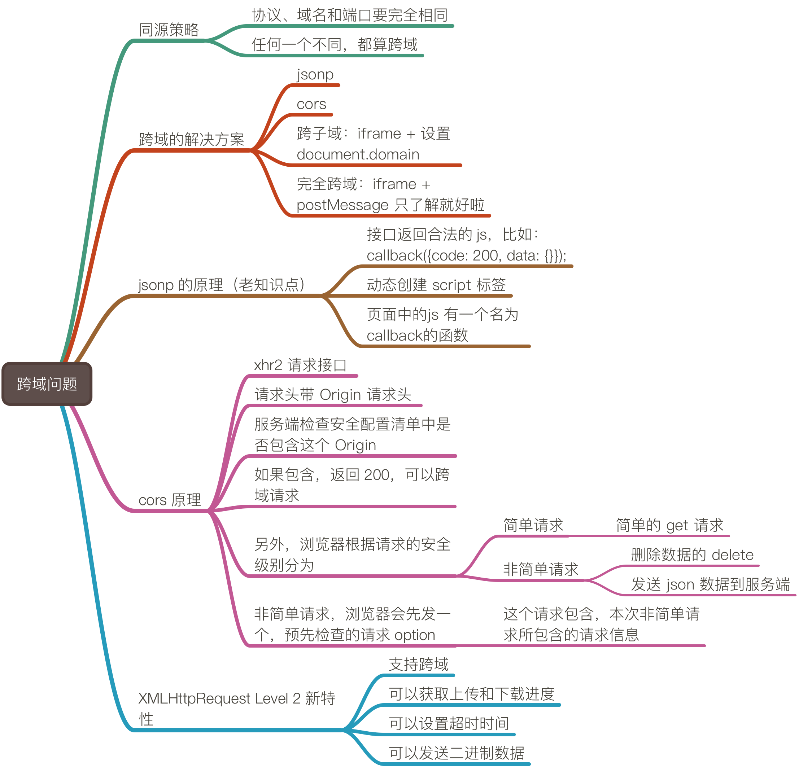

## 关于跨域问题



### 1、什么是浏览器的同源策略？
浏览器的同源策略是指页面中请求的资源地址跟当前页面 url 相比，三部分 **协议**、**域名**或**端口**，如果有任何一个不同，就属于违反同源策略，就算跨域，比如：

1. 协议不同，属于完全跨域 http://www.baidu.com 与 https://www.baidu.com 
2. 域名不同，分为二级域名不同或完全不同，只是二级域名不同，叫做**跨子域**，比如：http://a.baidu.com 与 http://b.baidu.com
3. 端口不同，比如：http://127.0.0.1:8000 与 http://127.0.0.1:7000

### 2、解决前端跨域问题的方案都有哪些？
1. 跨域通用的解决方案是 jsonp 和 cors；
2. 对于二级域名不同的跨子域，可以通过 iframe 的方式，设置iframe 内外两个页面的 `document.domain = ‘a.com’`
3. 另外完全跨域，也可以通过 iframe 配合 postMessage 方法来解决，但消耗很大不推荐使用，知道就好了。

### 3、JSONP 的原理是什么？缺点是什么
1.  原理：服务端返回合法的 js 语句，然后前端操作 dom 结构，动态创建 script 标签，创建完成时，浏览器能正常运行这些 js 语句。
2.  缺点：最大的缺点是只能发送 git 请求，没办法 post 数据到后端。

### 4、CORS 的流程是怎么样的？
浏览器端的 XMLHttpRequest Level 2 对象，在发送请求时，会在接口的请求头携带 “Origin”，服务端可以检查这个 “Origin” 在不在可信的配置清单里。

如果 Origin 是可信任的源，则返回 200 的同时，附加一些告诉浏览器合法的响应头，比如

```
Access-Control-Allow-Origin: http://api.bob.com
```

一般浏览器的请求按安全级别分为，简单请求和非简单请求，比如请求服务器删除数据的 delete http 方法、给 服务器post json 数据，就属于非简单请求，其它的属于简单氢气。

对于非简单氢气，浏览器会向服务器发送一个询问请求，http 方法是 “option“，每个 option 请求，包含这个非简单请求的信息，以争得服务器的同一。符合对复杂请求的安全配置，则 option 返回 200，跨域请求成立。

参考：[http://www.ruanyifeng.com/blog/2016/04/cors.html](http://www.ruanyifeng.com/blog/2016/04/cors.html)

### 5、XMLHttpRequest Level 2 新增的特性有哪些？
老版本的XMLHttpRequest对象有以下几个缺点：
1.  只支持文本数据的传送，无法用来读取和上传**二进制**文件。
2.  传送和接收数据时，**没有进度**信息，只能提示有没有完成。
3. 受到"同源策略 "（Same Origin Policy），只能向同一域名的服务器请求数据，不能跨域。

新版本的特性：
1.  支持设置超时时间。
2.  可以上传二进制数据。
3.  可以跨域上传数据。
4.  终于有上传和下载进度啦～
参考：
[http://www.ruanyifeng.com/blog/2012/09/xmlhttprequest_level_2.html](http://www.ruanyifeng.com/blog/2012/09/xmlhttprequest_level_2.html)