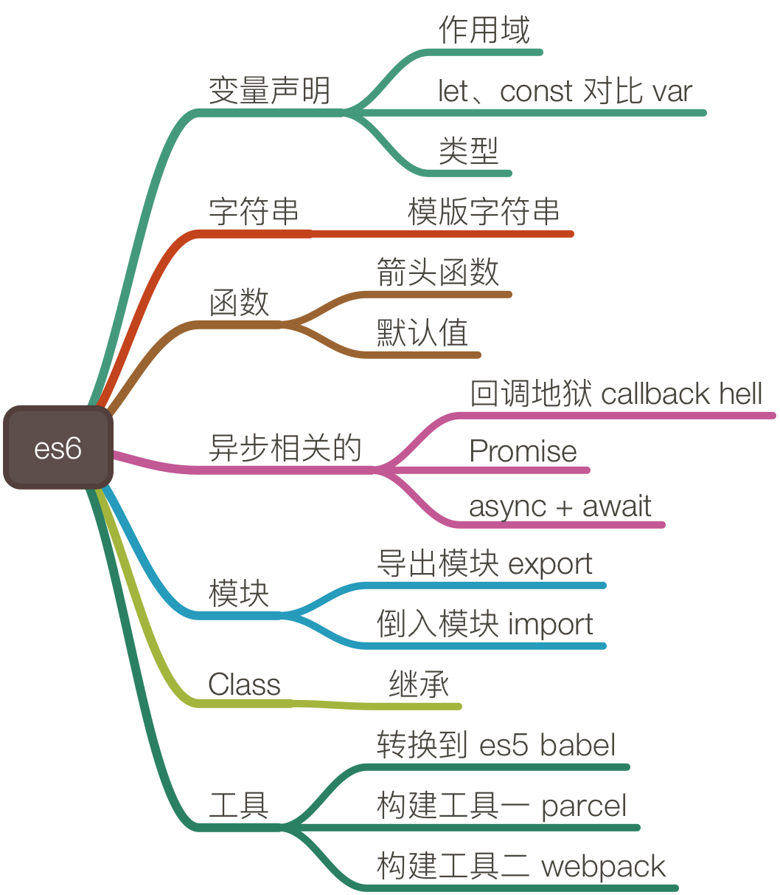

## ES6



### 1、什么是作用域？
变量的可访问范围，es6里有块级、函数级和全局作用域，其中块级作用域是新增的，比如条件判断的花括号是块级。

### 2、用 let、cosnt 跟用 var 定义变量的区别？
1. let 定义变量、const 定义常量，这两个支持块级作用域。
2. var 在整个函数定义有效，即函数级作用域。

### 3、ES6 中新增了哪些有用的功能特性？
1. 新的变量定义方式，代码表达更严谨。
2. 新的变量赋值方式，比如解构赋值，定义和访问更方便。
3. 原生的 class 关键字。
4. 箭头函数、函数支持设置默认值。

### 4、什么是解构赋值？
一种快速赋值和访问引用类型的方式，比如数组和对象。
```
const user = { name:  ‘wxnet’, email: ‘www@ddd.com’ };
const { name, email} = user;
```
### 5、箭头函数对比普通函数？
1、箭头函数的 this 指向的是当前环境，普通函数的 this 是可变的。
2、箭头函数必须先定义，才能使用，普通函数可以定义在访问代码的下方。

### 6、什么是回调地狱，es6 里有哪些解决方案？
1、很多层级的回调函数嵌套，代码可读性太差。
2、解决回调地狱主要用 Promise 和 异步函数，Promise 支持串联和并联的方式，异步函数支持同步的写法表达代码，实际上还是异步执行的。

### 7、异步函数（async function） 与 Promise 的关系？
1、异步函数内部的 await 关机字，后面可以是 Promise，Promise 的状态值是返回值。
2、异步函数的返回值是 Promise，可以用 Promise 提供的能力。

### 8、很多浏览器不支持 es6 的特性，那 es6 怎么用在项目中？
1、使用 babel 进行代码转换，用 parcel 或 webpack 打包。
2、parcel 和 webpack 的定位类似，但 parcel 不需要太多配置使用更方便，中小项目推荐用 parcel，webpack 更灵活，但配置复杂。