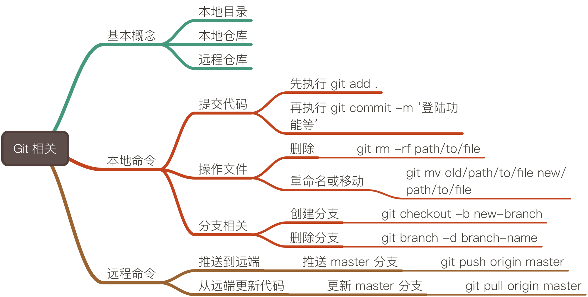

## GIT 相关



### 1、分支开发的意义是什么？
1. 生产环境、测试环境对应不同的分支，隔离不同环境，保证产品迭代的稳定性。
2. 开发新功能时，创建新的分支，保证多人并行开发，提升团度效率。

### 2、常用的 git 命令？
1、提交代码
```
$ git  add .
$ git commit -m ‘提交记录’
```
2、操作仓库中的文件
```
$ git rm -rf path/to/file
$ git mv old/path/to/file new/path/to/file
```

3、切换分支
```
$ git checkout branch-a
```

4、创建并切换分支
```
$ git checkout -b new-branch
```

4、更新本地 master 分支代码
```
$ git pull origin master
```

5、将本地代码推送到远程 master 分支
```
$ git push origin master
```

### 3、团队中的分支规范？
1、一般的分支策略
1. master 分支永远对应生产环境，可以随时用来上线
2. test 分支，是团队的集成测试分支
3. dev 分支，团队的开发分支。
4. 新功能分支 ：开发新功能时创建的分支。

2、合并的顺序
一般是自下而上的顺序，也就是：
1. 新功能开发完成，将新功能分支，合并到 dev 分支，开发自测。
2. dev 集成到一定的阶段后，会合并到 test 分支，测试团队主要测试 test 分支。
3. 测试完成后，会将 test 分支合并到 master 分支，上线。

### 4、git 工作流中的提交记录规范？
好的提交规范，非常有利于进行 codeReview，还能根据提交记录生成版本发布记录，推荐 Angular 社区的提交规范。
参考这篇文章
[http://www.ruanyifeng.com/blog/2016/01/commit_message_change_log.html](http://www.ruanyifeng.com/blog/2016/01/commit_message_change_log.html)