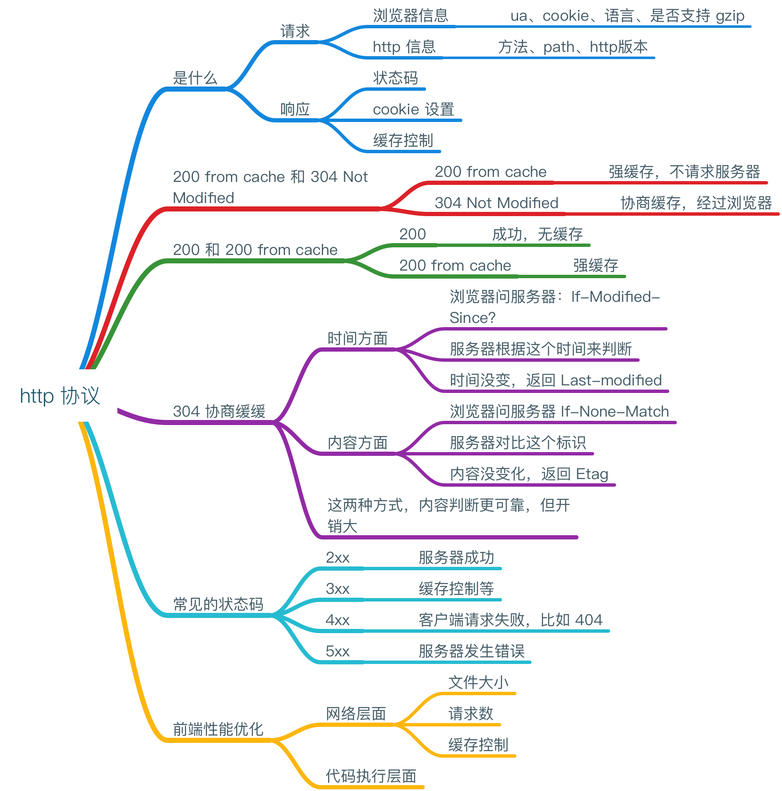

## http 协议



### http 协议有哪些部分组成？

1、向一个地址发起请求时，会包含：
1. http 的方法（GET、POST等）、请求路径、http协议版本
2. 会携带浏览器的信息：User-Agent、浏览器支持的编码、语言和存储的cookie

```
GET /news/1 HTTP/1.1

Host: github.com
User-Agent: Mozilla/5.0 (Macintosh; Intel Mac OS X 10_13_4) AppleWebKit/537.36 (KHTML, like Gecko) Chrome/66.0.3359.181 Safari/537.36
Accept: text/html,application/xhtml+xml,application/xml;q=0.9,image/webp,image/apng,*/*;q=0.8
Accept-Encoding: gzip, deflate, br
Accept-Language: en,zh-CN;q=0.9,zh;q=0.8
Cookie: _octo=GH1.1.519853820.1486525368;
```

2、服务端会对请求作出响应，返回的信息一般是下面的样子。
服务器对请求的回应，一般会包含：状态码（200 是成功、500 是服务器错误等）缓存控制部分、内容是不是经过了 gzip 压缩，内容的类型、生成内容的时间、服务器信息、向浏览器端写入 cookie。

```
Cache-Control: no-cache
Content-Encoding: gzip
Content-Type: text/html; charset=utf-8
Date: Fri, 08 Jun 2018 10:18:16 GMT
Server: GitHub.com
Set-Cookie: _gh_sess=1; path=/; secure; HttpOnly
Status: 200 OK
```

### 常见的状态码都有哪些？
常见的几种状态码：
1. 2xx 服务器成功
2. 301、302 都是地址跳转
3. 304 协商缓存
4. 40X 是客户端错误，比如 404 是请求的 url 不能存在。
5. 50x 是服务器错误

### 什么时候返回 200？
请求成功，没有经过任何缓存，服务器直接返回 200。

### 开发者工具中看到的 200 ok（from cache） 是什么？
当点击页面中的链接或在地址栏输入url按回车，浏览器会判断上次请求响应的缓存策略，200 from cache是性能最高的缓存，不会经过服务器。

### 什么时候返回 304 Not Modified 状态码呢？
当刷新页面时，浏览器端缓存失效，会去服务器端判断文件是不是有过修改，判断修改有两个纬度，一个是通过时间来判断，一个是通过内容的唯一标识来判断。

1. 时间纬度 - 请求头携带 If-Modified-Since，服务器发现时间没有变化，在 响应头 Last-modified 添加时间，返回内容。
2. 内容纬度 - 请求头携带 If-None-Match （文件的标识），服务器判断这个标识没变，则响应头添加  Etag，返回内容。

这两种纬度，etag 的方式更可靠，但性能开销大。

### 前端性能优化在 http 层面需要注意什么？
一般前端性能优化，可以从两个方面考虑，网络层面和代码执行层面，那网络层面一般有几个方面：

1. 内容的请求数量，js、css等静态资源的小文件要合并，以减少请求数。
2. 内容的大小，js、css静态文件要合并后压缩，缩减代码响应体积，另外文本文件可以通过 gzip 的方式压缩，浏览器一般会自动解压。
3. 缓存方面，一般会有强缓存 200 ok （from cache） 和 协商缓存 304 Not Modified，前端静态资源要通过某种方式来控制缓存，比如每次发布，目录会不同等。
